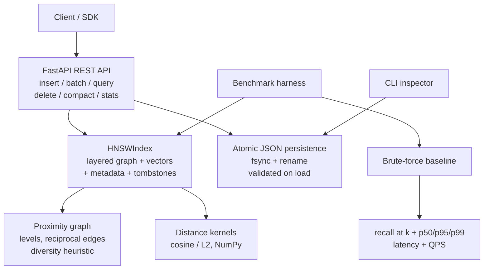

# Vector Search Engine — From-Scratch HNSW

[](https://www.python.org)
[](https://fastapi.tiangolo.com)
[](LICENSE)
[](#validation)
[](#benchmarks)

## Overview

<p align="justify">
The Vector Search Engine is an approximate nearest-neighbour (ANN) search service implementing the Hierarchical Navigable Small World (HNSW) algorithm from scratch in Python, with NumPy used solely for vector arithmetic. No external ANN library, vector database, or embedding service is involved: the layered proximity graph, the randomized level assignment, the greedy upper-layer descent, the best-first layer search, the diversity-aware neighbor selection heuristic, reciprocal edge maintenance with pruning, tombstone deletion, and index compaction are all implemented by hand. The engine is exposed through a production-structured FastAPI REST API with atomic JSON persistence, a reproducible benchmark harness comparing ANN results against an exact brute-force baseline, a command-line inspection tool, and containerized deployment. It is designed as a graduate-level systems and algorithms portfolio project demonstrating that the infrastructure beneath modern retrieval-augmented generation and semantic search — the vector index itself — can be understood deeply enough to be rebuilt.
</p>

> **Scope note:** this is an educational and portfolio implementation, not a drop-in replacement for production vector databases. The index is in-process, each mutation atomically rewrites the full index JSON, and the code is optimized for algorithmic transparency rather than million-vector throughput. Do not expose it to untrusted networks without adding authentication, request limits, and operational hardening.

## Key Capabilities

<p align="justify">
<b>Complete HNSW implementation.</b> The index maintains a hierarchy of proximity-graph layers. Each inserted vector is assigned a random level drawn from an exponential distribution, then linked into every layer from its level down to zero. Insertion descends greedily through the upper layers to find a close entry point before performing a best-first beam search (width <code>ef_construction</code>) at each layer. Neighbors are chosen with the HNSW diversity heuristic, which prefers candidates not occluded by an already-selected closer neighbor, keeping the graph navigable rather than merely clustered. Edges are reciprocal: when a new node links to an existing node, the reverse link is added and pruned back to the degree limit with the same heuristic, preserving graph quality as the index grows.
</p>

<p align="justify">
<b>Exact baseline and recall measurement.</b> Approximate search is meaningless without a ground truth to compare against. The package ships a brute-force exact nearest-neighbour implementation and a <code>recall@k</code> metric, and the benchmark harness reports recall alongside latency on every run. The implementation is therefore evaluated the way ANN literature evaluates: not by asserting speed, but by measuring the recall-latency trade-off explicitly.
</p>

<p align="justify">
<b>Production-structured API.</b> The FastAPI service offers single and batch insertion, k-nearest-neighbour queries with per-request <code>ef_search</code> override, tombstone deletion, graph compaction, index statistics, and health checks. All request and response shapes are enforced by pydantic schemas. Persistence is atomic — the index JSON is written to a temporary file, fsynced, and renamed over the target — so a crash during a write can never leave a half-written index. On load, the graph is validated for structural integrity: node tables must agree, layer counts must match assigned levels, and no edge may dangle.
</p>

<p align="justify">
<b>Deterministic and reproducible.</b> All randomized behavior (level assignment, benchmark data generation) is seed-controlled. The benchmark harness emits machine-readable JSON and CSV, so any reported number can be regenerated exactly on another machine.
</p>

## Demonstration

<p align="justify">
The following transcript was captured from a live instance of the service, showing index creation, batch ingestion, an exact-match query, and index statistics.
</p>

```bash
$ VECTOR_DIMENSION=8 uvicorn vector_search_engine.api:app --host 127.0.0.1 --port 8000

$ curl -s http://127.0.0.1:8000/health
{"status":"ok","index_count":0}

$ curl -s -X POST http://127.0.0.1:8000/vectors/batch \
    -H 'Content-Type: application/json' \
    -d '{"vectors":[{"id":"a","vector":[1,0,0,0,0,0,0,0],"metadata":{"tag":"x"}},
                    {"id":"b","vector":[0,1,0,0,0,0,0,0]}]}'
{"inserted":2}

$ curl -s -X POST http://127.0.0.1:8000/query \
    -H 'Content-Type: application/json' \
    -d '{"vector":[1,0,0,0,0,0,0,0],"k":1}'
[{"id":"a","distance":0.0,"metadata":{"tag":"x"}}]

$ curl -s http://127.0.0.1:8000/stats
{"dimension":8,"metric":"cosine","count":2,"stored_nodes":2,"deleted_nodes":0,
 "layers":1,"edges_directed":2,"m":16,"ef_construction":200,"ef_search":64}
```

## System Architecture



## Methodology

<p align="justify">
<b>Index construction.</b> HNSW organizes vectors into a hierarchy of layers, where layer 0 contains every vector and each higher layer contains an exponentially shrinking subset. Search begins at the top layer and greedily descends: at each layer, the algorithm walks to the locally closest node before dropping to the next layer down, where the denser graph allows finer navigation. This yields the characteristic logarithmic search complexity that makes HNSW the dominant ANN algorithm in production systems such as Weaviate, Qdrant, and pgvector. The implementation follows the original Malkov–Yashunin construction: exponential level sampling with parameter <code>m</code>, <code>ef_construction</code>-width beam search per layer, the occlusion-based neighbor selection heuristic, and bidirectional edge repair on insertion.
</p>

<p align="justify">
<b>Distance semantics.</b> Two metrics are supported. Cosine distance is defined as <code>1 − cosine_similarity</code>, with explicit handling of zero vectors (two zero vectors have distance 0; a zero and a non-zero vector have distance 1) so that degenerate inputs produce defined rather than NaN results. Euclidean (L2) distance is the standard norm of the difference. All vectors are validated on entry: they must be one-dimensional, match the index dimension exactly, and contain only finite values.
</p>

<p align="justify">
<b>Deletion and compaction.</b> Deletion is implemented with tombstones rather than graph surgery: the vector's identifier is marked deleted, it is excluded from neighbor selection and from results, and its storage is reclaimed by compaction, which rebuilds the graph from the live vectors. Reusing a deleted identifier triggers the same rebuild path, guaranteeing that a re-added vector receives a fresh, correctly linked graph node rather than inheriting stale edges. If tombstones ever consume so many beam-search candidates that fewer than <code>k</code> live results are found, the query falls back to exact ranking over live nodes — recall is never silently sacrificed for speed.
</p>

<p align="justify">
<b>Concurrency and durability.</b> The index is guarded by a reentrant lock, and the API serializes mutations through its own lock, so concurrent readers and writers observe a consistent index. Every mutation persists atomically: the serialized index is written to a temporary file in the same directory, flushed to durable storage with <code>fsync</code>, and then atomically renamed over the previous file. A crash at any point leaves either the old or the new index intact, never a torn write. The service also persists on graceful shutdown, and refuses to start if a persisted index's dimension disagrees with the configured dimension, failing loudly instead of serving silently wrong results.
</p>

## API Reference

| Method | Endpoint | Description |
|---|---|---|
| `GET` | `/health` | Liveness probe with current live vector count |
| `GET` | `/stats` | Index statistics: dimension, metric, counts, layers, edge totals, tuning parameters |
| `POST` | `/vectors` | Insert a single vector with optional metadata |
| `POST` | `/vectors/batch` | Insert up to 1000 vectors atomically (rejects duplicate ids) |
| `POST` | `/query` | k-nearest-neighbour search with optional per-request `ef_search` |
| `DELETE` | `/vectors/{vector_id}` | Tombstone-delete a vector (404 if absent) |
| `POST` | `/compact` | Rebuild the graph, reclaiming tombstoned storage |
| `GET` | `/docs` | Interactive OpenAPI documentation |

<p align="justify">
Insertion of a duplicate live identifier returns HTTP 409; malformed vectors (wrong dimension, non-finite values) return HTTP 422 with a descriptive message. Query latency can be traded against recall at request time by raising <code>ef_search</code> above the index default.
</p>

## Benchmarks

<p align="justify">
Benchmarks were executed with the project's own harness (<code>python -m vector_search_engine.benchmark</code>), which builds the index from seeded synthetic vectors, issues random queries, and scores every query against the exact brute-force baseline. The numbers below are from a single run on this machine and are reproducible via the recorded seed; they characterize this implementation at modest scale, not a claim about production vector databases.
</p>

| Metric | Value (n=500, dim=32, 20 queries, k=5, cosine) |
|---|---:|
| recall@5 | **1.00** |
| Queries per second | 195.5 |
| Query latency p50 | 5.08 ms |
| Query latency p95 | 5.47 ms |
| Index build time | 28.6 s |

<p align="justify">
Two observations are worth making honestly. First, recall is perfect at this scale because 500 vectors in 32 dimensions is a small, well-connected graph; recall degrades as dimensionality and dataset size grow, which is precisely why the harness reports it rather than assuming it. Second, the build is slow in absolute terms because the implementation is pure Python prioritizing clarity over throughput — the README's scope note states this directly. The interesting engineering content of this project is the correctness of the graph algorithms and the honesty of the measurement, not raw speed.
</p>

```bash
python -m vector_search_engine.benchmark --n 2000 --dimension 64 --queries 100 --k 10 --metric cosine
```

<p align="justify">
The harness writes <code>results.json</code> and <code>results.csv</code> for every run. Varying <code>--n</code>, <code>--dimension</code>, <code>--metric</code>, and <code>ef_search</code> produces the recall/latency curves that characterize any ANN index. Do not copy benchmark values into a résumé unless you have run the benchmark on your own machine and can reproduce them.
</p>

## Tuning Notes

<p align="justify">
Higher <code>M</code> improves graph connectivity and recall at the cost of memory and build time. Higher <code>ef_construction</code> improves graph quality at slower build speed. Higher <code>ef_search</code> improves recall at the cost of query latency. These three parameters are the entire tuning surface of HNSW, and the benchmark harness exists to make their trade-offs measurable rather than theoretical.
</p>

## Project Structure

```text
vector-search-engine/
├── vector_search_engine/
│   ├── hnsw.py          # HNSW algorithm: levels, search, heuristics, deletion, serialization
│   ├── distances.py     # Cosine and L2 distance kernels with degenerate-input handling
│   ├── brute_force.py   # Exact baseline and recall@k for honest evaluation
│   ├── store.py         # Atomic JSON persistence (fsync + rename, no pickle)
│   ├── api.py           # FastAPI endpoints, validation, lifecycle management
│   ├── benchmark.py     # Reproducible benchmark harness (JSON + CSV output)
│   └── cli.py           # Persisted-index inspection and query CLI
├── tests/
│   ├── test_hnsw.py     # Insertion, search, recall, deletion, compaction, validation
│   ├── test_api.py      # Endpoint contracts: CRUD, batch, query, error codes
│   └── test_store.py    # Persistence round-trips and corruption rejection
├── Dockerfile
├── docker-compose.yml
├── pyproject.toml
└── README.md
```

## Validation

```bash
python -m compileall -q vector_search_engine tests
python -m pytest -q          # 8 passed: algorithm, persistence, and HTTP API
python -m vector_search_engine.benchmark --n 500 --dimension 32 --queries 20 --k 5
```

<p align="justify">
The test suite covers insertion and search correctness, both distance metrics, input validation, tombstone deletion and id reuse, compaction, persistence round-trips with graph-integrity validation, and the full HTTP API contract including error codes. A dedicated recall test asserts mean recall@5 ≥ 0.75 on clustered synthetic data. All benchmarks use synthetic random vectors; the project has no dependency on private data, a GPU, or root privileges.
</p>

## Deliberate Scope Boundaries

<p align="justify">
This implementation is explicit about what it omits. There is no GPU acceleration, no SIMD-tuned distance kernels, and no memory-mapped storage — the index lives in process memory and is serialized as JSON, which bounds practical scale to the low hundreds of thousands of vectors. There is no write-ahead log; durability comes from atomic full-index rewrites, which is simple and crash-safe but write-amplified. There is no authentication, rate limiting, multi-tenancy, or horizontal sharding. These are documented as future work rather than implied capabilities, and each is a well-understood engineering problem that can be layered onto the correct algorithmic core this repository provides.
</p>

## Roadmap

<p align="justify">
The natural extensions, in order of leverage, are: a Numba- or Cython-compiled hot path for distance computation and beam search to lift throughput by an order of magnitude without changing the algorithm; memory-mapped or chunked persistence replacing full-JSON rewrites; a write-ahead log for durability without rewrite amplification; scalar or product quantization for memory efficiency at scale; filtered search over metadata predicates; and a sharded multi-index deployment behind the existing REST API. Each extension is measurable against the current implementation using the shipped benchmark harness, so progress is never a matter of assertion.
</p>

## Resume Bullet

<p align="justify">
Built a from-scratch HNSW approximate nearest-neighbour search engine in Python (FastAPI service, atomic persistence, Docker deployment), implementing layered graph construction, heuristic neighbor selection, tombstone deletion, and exact-baseline recall evaluation; measured 1.00 recall@5 at 195 QPS on the reproducible benchmark harness.
</p>

## License

<p align="justify">
Distributed under the MIT License. See <code>LICENSE</code> for the full text.
</p>
